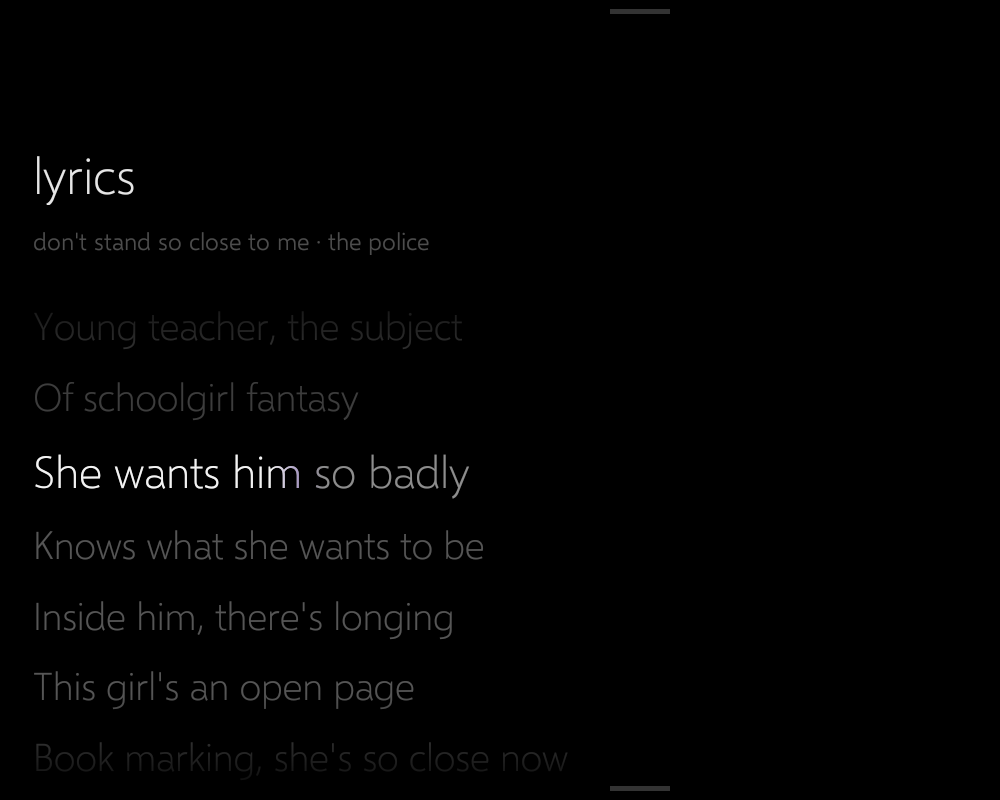

# AGENTS.md: working on this repo

This is for AI coding agents (and humans) who clone this repo. It explains what the project is, how the pieces
fit together, the rules that must never be broken, and step-by-step procedures for building, deploying and verifying
each part. The human-facing walkthrough is in `docs/` (chapters 1–10). This file is the operator's manual.

> **Disclaimer.** Everything here is what worked on the owner's own TB-8505X, firmware and laptop. It may not work on
> other devices, and the owner takes no responsibility for bricked devices or lost data (see the disclaimer in
> `README.md`). If you act for a user on *their* device, make sure they know this. Never run the destructive steps
> (unlock, flashing, partition writes) without their explicit go-ahead and a verified backup (`docs/01`).

## 1. What this project is

A first-gen **Lenovo Tab M8 HD (TB-8505X)**, rooted and running **LineageOS 18.1 (Android 11) GSI**, mounted on a
wall next to a Windows 11 laptop and connected to it **by one USB cable**. Over that cable it is:

- a **third monitor** for the laptop (spacedesk, USB accessory mode);
- a **webcam** for the laptop at the same time (its front camera appears in Windows as "Tablet Camera");
- a **Windows Phone 8-style home screen, "Lumia Wall"**. It's a panorama whose sections are:
  - **windows**: laptop vitals and controls, a Steam Deck-style companion (left of home);
  - **grace wall**: live tiles; this is the home section;
  - **music**: the laptop's now playing, transport buttons and a live spectrum;
  - **lyrics**: synced lyrics with tap-to-seek (only present when the song has lyrics);
  - **status** and **apps**.
  - Plus a pull-down **action center** (quick settings) and a pull-up **day sheet** (Google Keep notes and calendar).

What it looks like (all screenshots are from the real tablet):

| | |
|---|---|
|  grace wall (home) |  music |
|  lyrics |  windows |
|  action center (pull down) | |

The day sheet and status section are deliberately not pictured: they show personal notes, events and network details.

## 2. Architecture

```
                        one USB cable (MTP mode + adb debugging)
  Windows 11 laptop  <---------------------------------------------->  Tab M8 (rooted LineageOS 18.1)
  ------------------                                                   ------------------------------
  spacedesk driver   <------ USB accessory (18D1:2D01) -------------->  spacedesk app (third display)
  Tablet Camera vcam  <- adb forward tcp:8765 -> tablet tcp:8080 -----  CameraStreamService (MJPEG, 127.0.0.1:8080)
  WallBridge (.NET)   ---- adb reverse tcp:8770 <- tablet tcp:8770 ---  Lumia Wall (MusicBridge, DaySheet, WindowsSection)
   +- keepcal.py (child: Google Keep + Calendar sync)
  ipwebcam-tunnel.ps1: keeps the forward + reverse alive (every 5 s)
```

| Port | Where | What |
|---|---|---|
| 8080 | tablet 127.0.0.1 | `CameraStreamService`: `/video` (MJPEG), `/shot.jpg`, `/status.json`. The camera opens only while a client is connected. |
| 8765 | laptop 127.0.0.1 | `adb forward` to tablet 8080; read by the Tablet Camera DLL |
| 8770 | laptop 127.0.0.1 | **WallBridge** HTTP; the tablet reaches it as its own 127.0.0.1:8770 via `adb reverse` |

Everything is loopback-only on both sides. Nothing listens on the LAN.

### WallBridge endpoints (`bridge/WallBridge/Program.cs`)

| Endpoint | Purpose |
|---|---|
| `/state`, `/art`, `/spectrum`, `/cmd/{playpause,next,prev}`, `/cmd/seek?ms=` | now playing (Windows SMTC), cover art, loopback FFT stream, transport |
| `/lyrics` | synced lyrics from LRCLIB (free, keyless), cached per track |
| `/keep`, `/calendar`, `/keep/{check,add,refresh}?…` | day sheet data and edits (files written by `keepcal.py`) |
| `/sys/stats`, `/sys/state`, `/sys/cmd/{output,volume,mute,micmute,bluetooth,brightness,power,lock,sleep}` | windows section |
| `/debug` | raw SMTC sessions, for diagnosing |

## 3. Rules. Read before doing anything

1. **Never commit `private/`, `images/`, `downloads/` or build output.** `private/` holds partition dumps with the
   device's **IMEI, serial and NVRAM**. They are irreplaceable and must never be shared or pushed anywhere, not even to a private repo.
2. **Never put the tablet's serial number or IMEI in any tracked file.** Scripts find the tablet with
   `scripts/windows/find-tablet.ps1` (it matches `ro.product.vendor.model` = `Lenovo TB-8505X`), or use
   `$env:TABLET_SERIAL`.
3. **Never flash TWRP on this model**; it has bricked others. Use fastboot only. Never flash TB-8505X firmware on a TB-8505F or vice versa.
4. **Other Android devices may be plugged in** (e.g. a Samsung J7 and the owner's daily phone). Never run adb commands without
   `-s <tablet>`, and never modify a device that isn't the TB-8505X.
5. **Use the bundled adb 1.0.40** (`downloads\adb-1.0.40\platform-tools\adb.exe`, not in git). Camo Studio ships adb 1.0.40,
   and a different adb version kills its server (and with it the tunnels). If you set this up fresh without Camo, any adb works.
6. **The laptop side must stay near-zero load.** The owner insists on it. Background loops in WallBridge are demand-driven
   (`Demand.cs`: they only work while the tablet asked recently), and expensive Windows calls are cached.
   - Budget: under 0.3 % of one core and about 110 MB RAM for WallBridge.
   - After any bridge change, measure with `scripts/windows/measure-bridge.ps1` (numbers are in `docs/10`).
7. **Light sensitivity.** The owner finds bright whites painful. UI must stay dark: text at most 90 % white
   (`Metro.TEXT = 0xE6FFFFFF`), deepened accents, no white fills. Tablet brightness is kept low (about 60/255).
8. **Commits:** author as the repo owner (`udaysinh-git`), with **no AI attribution**: no `Co-Authored-By` trailers and no
   "generated with" lines.
9. **Secrets:** the Google master token lives only in Windows Credential Manager (`WallBridge-google`). Synced notes and
   events live in `%LOCALAPPDATA%\WallBridge`. Neither ever goes in the repo or onto the tablet.
10. Don't take OTA updates on the tablet. vbmeta and boot are modified.

## 4. Repo map

```
AGENTS.md, README.md
docs/01..10-*.md          the guide (root, ROM, charge limit, display, webcam, Lumia Wall, day sheet, windows section)
docs/screenshots/         real tablet screenshots (nothing personal)
lumia/                    Lumia Wall, the tablet app (package io.uday.lumiawall), Gradle-less
  build.ps1               aapt2 + javac + d8 + apksigner; -Install pushes and launches it
  src/io/uday/lumiawall/
    WallActivity.java     the panorama, sections, tiles, lifecycle, gestures (SEC_* constants = section order)
    Panorama.java         WP8 panorama (single-glide snapping, parallax title, homeSection)
    Metro.java, Tile.java, Glyph.java, MetroSlider.java   design language: palette, tilt/flip/turnstile, glyphs
    MusicBridge.java, VisView.java, LyricsView.java       music, spectrum, lyrics
    ActionCenter.java     pull-down quick settings (root via Root.java)
    DaySheet.java         pull-up Keep + Calendar
    WindowsSection.java   laptop vitals + controls
    CameraStreamService.java   front camera -> MJPEG on 127.0.0.1:8080 (foreground service, type camera)
    EdgeService.java      invisible top-edge strip -> notification shade (the status bar is hidden)
    Probes.java, Root.java    HTTP/TCP probes, weather; su helper
  buildstubs/             compile-only LambdaMetafactory stub (android.jar lacks it)
bridge/WallBridge/        laptop companion (.NET 9 WinExe): SMTC, spectrum, lyrics, Keep/Calendar host, Windows stats/controls
bridge/keepcal/keepcal.py Google Keep (gkeepapi) + Calendar sync; run by WallBridge as a child process
overlays/WallBars/        resource overlay: status bar height 0 (installed as a Magisk module by build-wallbars.ps1)
scripts/android/          root scripts for the tablet (Magisk service.d: wall-boot.sh, charge-limit.sh; backups; diagnostics)
scripts/windows/          laptop helpers: tunnel keeper, display setup, spacedesk driver fix, find-tablet, measure-bridge
vcam/                     "Tablet Camera" Windows 11 virtual camera (C++, from Microsoft's MIT sample) + installer
```

## 5. Prerequisites (laptop)

- Windows 11 (the virtual camera needs Windows 11's `MFCreateVirtualCamera`).
- Android SDK with **build-tools 35.0.0** and **platform android-35**, plus a JDK (`javac`).
  - `lumia/build.ps1` and `overlays/build-wallbars.ps1` expect the SDK at `E:\DevData\Android\Sdk`. Change `$sdk` if yours differs.
  - The APK is signed with `%USERPROFILE%\.android\debug.keystore`.
- **.NET 9 SDK** (WallBridge). The local `bridge/nuget.config` adds nuget.org.
- **Python 3.13** (a normal install, not the Microsoft Store one, whose sandbox breaks things) for `keepcal.py`.
- Visual Studio 2022 with C++ (only to rebuild `vcam/`).
- spacedesk Windows driver. **Do not have Samsung's "USB Driver for Mobile Phones" installed**: it claims the generic accessory
  ID and makes spacedesk drop every ~2 minutes (docs/05, docs/06).

## 6. Procedures

### 6.1 From a stock tablet to a rooted LineageOS one
Follow `docs/01`→`docs/03` exactly. In short:
1. Get the exact stock ROM with Lenovo Software Fix.
2. Unlock with `fastboot flashing unlock`.
3. Patch boot with Magisk.
4. Disable vbmeta verification by setting **byte 123 to `0x03`**. fastboot 36 can't do it on this image.
5. Flash the AndyYan **LineageOS 18.1 `arm64_bvS`** GSI and re-root.
6. **Back up `nvram`, `nvdata`, `proinfo` and `persist` into `private/`** as soon as you have root.

### 6.2 Build and install Lumia Wall
```powershell
lumia\build.ps1 -Install                     # finds the tablet itself; or set $env:TABLET_SERIAL
adb -s <tablet> shell cmd package set-home-activity io.uday.lumiawall/.WallActivity
adb -s <tablet> shell pm grant io.uday.lumiawall android.permission.CAMERA
adb -s <tablet> shell appops set io.uday.lumiawall SYSTEM_ALERT_WINDOW allow       # EdgeService strip
# root without prompts for the action center (uid from: dumpsys package io.uday.lumiawall | grep userId)
adb -s <tablet> shell "su -c 'magisk --sqlite \"REPLACE INTO policies (uid,policy,until,logging,notification) VALUES(<uid>,2,0,0,0)\"'"
```
- The Magisk grant is keyed by uid. A **reinstall** keeps the uid; an **uninstall and install** may change it, so re-run the grant.
- The build is framework-only (no AndroidX, no Gradle). Lambdas compile thanks to the stub in `buildstubs/`, and d8 desugars them.
- Assets are zipped by hand because `aapt2 -A` on Windows writes `assets/fonts\x.ttf` with a backslash, and Android then can't
  find the fonts.

### 6.3 Laptop side: WallBridge, tunnel keeper, keepcal
```powershell
Get-Process WallBridge -ErrorAction SilentlyContinue | Stop-Process -Force      # the exe is locked while running
dotnet publish bridge\WallBridge -c Release -o bridge\out
Start-Process bridge\out\WallBridge.exe
```
- Both **`bridge\out\WallBridge.exe`** and **`scripts\windows\ipwebcam-tunnel.vbs`** (a hidden launcher for the tunnel keeper) are
  started at sign-in from `shell:startup` shortcuts.
- WallBridge is single-instance (a mutex). It starts `keepcal.py loop --parent <pid>` itself once a Google login exists.
- keepcal first-time setup and the sign-in flow: see `docs/09` (EmbeddedSetup, then the `oauth_token` cookie, then
  `keepcal.py login`).
- When killing WallBridge to redeploy, also kill `python.exe … keepcal.py loop`. It exits on its own when its parent is gone,
  but only within about 5 s.

### 6.4 Tablet boot scripts (Magisk `service.d`)
`scripts/android/wall-boot.sh` and `charge-limit.sh` live in `/data/adb/service.d/` on the tablet.
- **Boot sequence:** open Lumia Wall (which starts the camera server), then spacedesk.
- **Watchdog:** every 60 s, restart the camera server if port 8080 isn't in LISTEN state. It checks `st == 0A`, because
  TIME_WAIT sockets fooled an earlier version. It skips this while `/data/local/tmp/wall/camera.off` exists.
- **Charge limiter:** holds 50–60 % through `/proc/mtk_battery_cmd/current_cmd`. It suspends the limit while
  `/data/local/tmp/wall/charge.full` exists. Checks run every 20 s.

To update them on a running tablet:
1. Push the files.
2. `cp` them into `service.d` as root and `chmod 755` them.
3. **Kill the old loops by PID.** `pkill -f` did not kill them.
4. Relaunch with `setsid nohup sh /data/adb/service.d/<script> &`.

When relaunched on a tablet that has been up more than 10 min, `wall-boot.sh` only resumes the watchdog. It won't replay the boot
sequence.

### 6.5 System bars (gesture navigation, hidden status bar)
```powershell
adb -s <tablet> shell cmd overlay enable-exclusive --category com.android.internal.systemui.navbar.gestural
overlays\build-wallbars.ps1 -Install        # Magisk module 'wallbars'; then REBOOT the tablet
adb -s <tablet> shell cmd overlay enable io.uday.wallbars    # once after the reboot; persists
```
- Android 11 removed `policy_control`, so the status bar can only be hidden with this overlay.
- `EdgeService` gives notifications back via a top-edge swipe. It must be a **foreground** service: Android stopped the plain
  background version after a minute.
- The Settings app hides third-party overlays, so the edge swipe doesn't work inside Settings.

### 6.6 Webcam
Build `vcam/`, then run `vcam\install-tablet-camera.ps1` elevated. It:
- registers the COM source;
- sets `HKLM\SOFTWARE\TabletCamera\Rotation=180` (the tablet is mounted upside down);
- registers the "Tablet Camera" virtual camera.

The camera is single-client and shows a dim placeholder for the first few seconds after it's opened.

### 6.7 spacedesk display
See `docs/05`:
- Tablet USB must be in **File Transfer (MTP)** mode. In adb-only mode Windows binds the whole device to adb.
- **Don't** change USB mode with `setprop persist.sys.usb.config`: it kills the session.
- `scripts/windows/set-tablet-display.ps1` sets 1280x800 and the flipped orientation.
- `close-spacedesk-nag` closes spacedesk's popup.
- Portmaster (if installed) needs a per-app exception.

## 7. Verifying your change

- **Screenshot the tablet:** `adb -s <tablet> shell screencap -p /sdcard/s.png` then `adb pull`. Coordinates for `input tap`/`swipe`
  are in the rotated display space (1280x800 landscape).
  - Swiping from x=1100 to x=200 at y=450 moves one panorama section right.
  - The HOME key returns to grace wall.
  - A downward swipe from y≈150 opens the action center. An upward swipe from y≈790 opens the day sheet.
- **Crash log:** `adb -s <tablet> logcat -d -b crash`.
- **Views:** `adb -s <tablet> shell dumpsys activity top` gives the view tree with visibility flags (`V`/`G`).
- **Bridge:** `curl http://127.0.0.1:8770/state`, `/sys/stats` and friends. `/debug` shows the raw SMTC sessions.
- **Laptop load:** run `scripts\windows\measure-bridge.ps1 -Label <name>` while the tablet shows the relevant section.
  Compare with the table in `docs/10`.
- **Before committing,** grep for secrets: no serial, no IMEI, no `aas_et/` or `oauth2_4/` tokens, and nothing from `private/`.

## 8. Code conventions

- **Match the surrounding code.** Comment density is light but explains *why*. Lowercase WP-style labels ("grace wall",
  "sound output"). Selawik fonts through `Metro.light/semilight/regular`. Palette constants live in `Metro`.
- **New panorama section:**
  1. `pano.addSection("name", widthDp)` in `WallActivity.onCreate`.
  2. Update the `SEC_*` constants: the order matters, and `SEC_HOME` must stay grace wall.
  3. Poll only while the section is visible. See `updateWindows()` / `updateSpectrum()`, driven by `pano.onScroll` plus
     resume/pause.
- **New WallBridge endpoint:**
  1. Add a branch in `Program.Handle`.
  2. If it needs background work, gate it with `Demand.Active(topic)` and `Demand.Touch(topic)` from the endpoint.
  3. Cache anything that costs more than about 1 ms per call.
- **Tablet-to-laptop commands:** optimistic UI first, then the request on a separate thread. Guard against stale reads (see
  `WindowsSection.cmdSeq`) so a poll never undoes a tap.
- **Root on the tablet:** `Root.run()` off the UI thread. Flags shared with the service.d scripts go in `Root.FLAGS`
  (`/data/local/tmp/wall`).
- **Docs:** when behaviour changes, update the matching `docs/NN-*.md` chapter and, if needed, this file. Write docs with a
  file-writing tool, not PowerShell here-strings: backticks in Markdown get eaten and corrupt the file.

## 9. Known quirks (not bugs to "fix" blindly)

- **Browsers:** many sites never tell SMTC they paused. WallBridge infers pause from per-app audio meters (`AudioActivity.cs`).
- **Spotify 1.3** sometimes publishes an empty 0/0 timeline for a whole track. WallBridge then counts from the track start
  itself (`estimated`), and a lyric tap re-syncs it.
- **Default speaker:** switching it uses the undocumented `IPolicyConfig` COM interface, the one the Sound settings use.
- **CPU temperature** isn't shown: reading it needs a kernel driver and admin rights, and WallBridge stays unprivileged.
- **Legcord (a Discord client)** lists the Tablet Camera and the laptop camera as a single device; Discord itself is fine.
- **Keep API:** there is no official Keep API for personal accounts. `gkeepapi` uses the Keep Android app's own protocol and
  could break if Google changes it.
