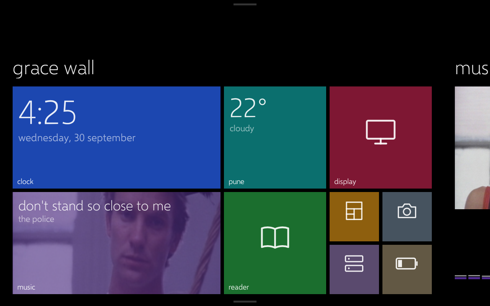
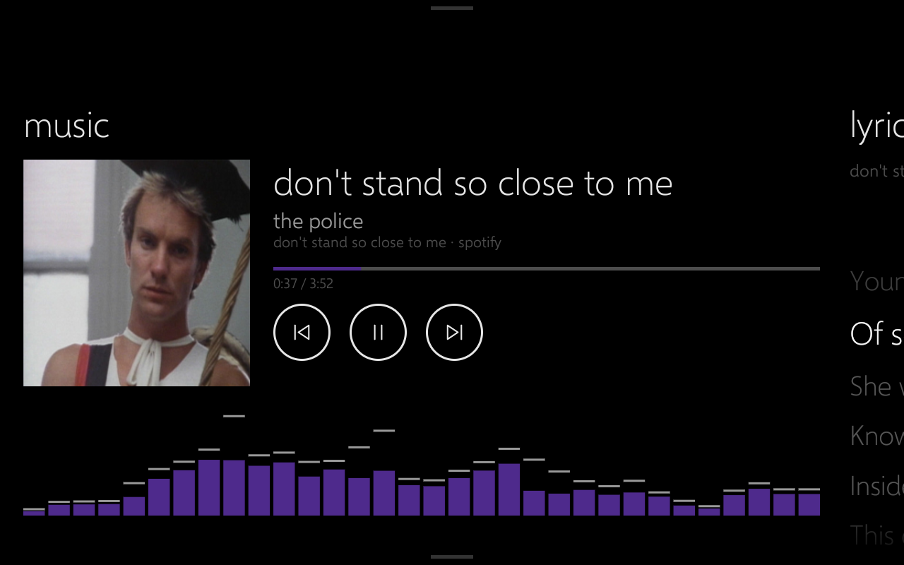
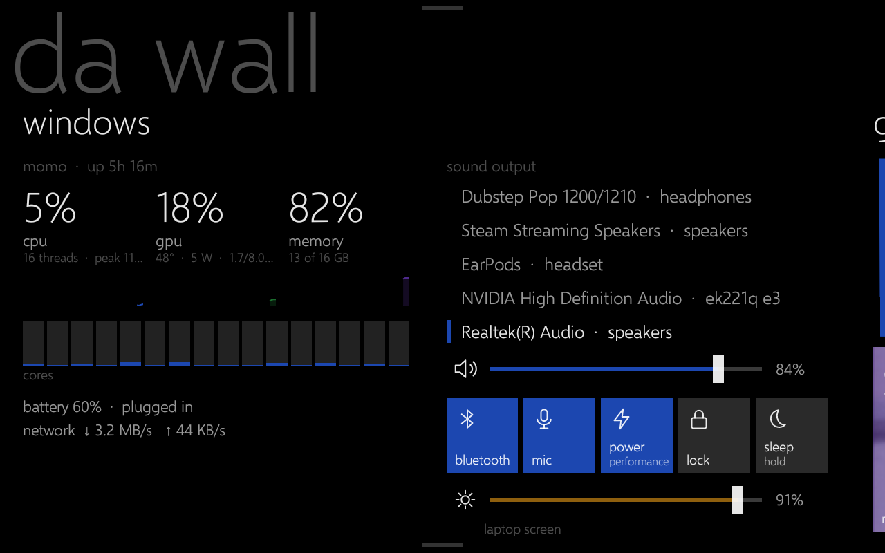
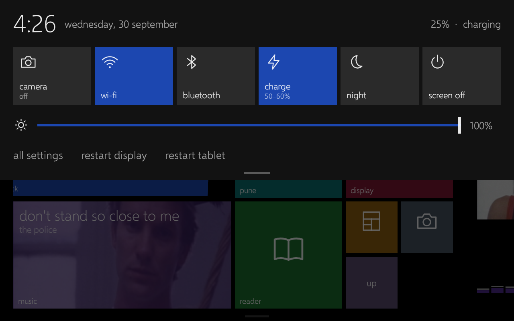

# Lenovo Tab M8 HD (TB-8505X / TB-8505F): root, LineageOS, and a wall-mounted display

A complete, tested walkthrough for rooting the first-gen **Lenovo Tab M8 HD** (MediaTek Helio A22),
running a lighter **LineageOS 18.1** GSI on it, and turning it into an always-on **extra monitor**
for a Windows PC.

It also covers what the existing XDA threads leave out: the exact firmware source, a `fastboot`
bug that breaks the usual vbmeta step, which GSI variant actually boots, a working **charge limiter**
for this chip, and the driver/firewall traps behind "spacedesk USB keeps disconnecting".

> Everything here was done on a **TB-8505X** (LTE) on 2026-09-29. The TB-8505F (Wi-Fi) is the same
> platform, but **never flash X firmware on an F or vice versa**.

> [!CAUTION]
> **Disclaimer: use at your own risk.** This is what worked on **my** tablet, with my firmware version, my laptop and
> my setup. It may not work on yours. A different hardware revision, firmware build, region, bootloader state or Windows
> setup can change the outcome. Unlocking, rooting and flashing can **wipe your data, void your warranty, or brick the
> device**, and some of it (IMEI/NVRAM damage, for example) can't be undone.
>
> I'm **not responsible** if you break your tablet, lose data or damage anything else by following this guide or
> running anything in this repo. Read each step fully, back up first (chapter 1), and only continue if you understand
> what a step does and accept the risk. Everything here is provided **as is, without any warranty**.

## Device

| | |
|---|---|
| SoC | MediaTek Helio A22 (`mt6761`, hardware `mt8766`), 4x Cortex-A53 |
| RAM / storage | 2 GB / 32 GB eMMC |
| Stock | Android 10, build `TB-8505X_S301129_230914_BMP`, patch 2023-08-05 |
| Partitions | Non-A/B, no dynamic partitions (no `super`), Treble, system-as-root |
| Boot image | Header v2, 32 MiB, gzip kernel + ramdisk |
| Bootloader | Unlockable with `fastboot flashing unlock`, no Lenovo code needed |

Full `getprop` highlights and the partition list: [`docs/device-info_stock.txt`](docs/device-info_stock.txt).

## Guide

1. [Get the exact stock firmware and back up the tablet](docs/01-firmware-and-backup.md)
2. [Unlock the bootloader and root with Magisk](docs/02-unlock-and-root.md). This includes the `fastboot` vbmeta bug and fix.
3. [Flash LineageOS 18.1 (GSI) and keep root](docs/03-lineageos-gsi.md)
4. [Charge limiter for an always-plugged tablet](docs/04-charge-limiter.md)
5. [Use it as a Windows extra monitor (spacedesk over USB)](docs/05-wall-display-spacedesk.md)
6. [Troubleshooting and dead ends](docs/06-troubleshooting.md)
7. [Use it as an extra webcam at the same time as the display (Windows 11 virtual camera)](docs/07-webcam-camo.md)
8. [Lumia Wall: a Windows Phone 8 home screen for the wall](docs/08-lumia-wall.md)
9. [Day sheet: Google Keep + today's calendar](docs/09-day-sheet.md)
10. [The "windows" section: laptop vitals and controls](docs/10-windows-section.md)

## New findings

- **Firmware:** Lenovo's **Software Fix** tool (formerly Rescue and Smart Assistant) downloads the exact current build for free.
  It **deletes the zip after extracting**, so copy `RomFiles\<build>\` out before you close it.
- **`fastboot` 36.x can't disable vbmeta verification on this image.** It fails with `Failed to find AVB_MAGIC at offset: 0`,
  even though the image is valid. Fix: set the AVB flags word yourself. That's **one byte: offset 123 → `0x03`**.
- **GSI:** the device reports `system_root_image=false`, but `/` *is* system, so the arm64 **"b"** images are the right ones.
  AndyYan's **LineageOS 18.1 `arm64_bvS`** boots in about 100 s. Android 15 GSIs don't boot.
- **Charge limiting works** via MediaTek's `/proc/mtk_battery_cmd/current_cmd` (`"0 1"` stops charging, `"0 0"` resumes).
  A small Magisk boot script holds the battery at 50–60 %.
- **spacedesk "USB Cable Android" dropping every ~2 minutes** was caused by **Samsung's "USB Driver for Mobile Phones"**, which
  claims Google's generic accessory ID `18D1:2D01` and fails on it. Its uninstaller also **deletes spacedesk's own USB driver**.
  Fix: uninstall Samsung's driver, repair spacedesk, then (if needed) force-bind spacedesk's driver. After that the connection held
  well past the old ~2:06 cut-off.
- **spacedesk needs the tablet's USB in File Transfer (MTP) mode**, not adb-only. In adb-only mode Windows binds the whole device
  to the adb driver and spacedesk can't switch it into accessory mode.
- **Webcam and display at the same time:** IP Webcam streams from a background service over an `adb forward`, and a small
  **Windows 11 virtual camera** (built from Microsoft's sample, source in `vcam/`) turns it into a camera every app sees.
- A **third-party firewall (Portmaster)** silently drops the viewer's LAN discovery below Windows Firewall, so nothing shows in
  Windows' logs. Fix: a per-app exception.

## Repo layout

```
AGENTS.md           operator's manual for AI agents / contributors: architecture, rules, build + deploy procedures
docs/               the guide (chapters 1-10) and docs/screenshots/
lumia/              Lumia Wall, the tablet's WP8-style home screen (Gradle-less Android app)
bridge/             WallBridge (.NET 9 laptop companion) and keepcal.py (Google Keep + Calendar sync)
overlays/           WallBars resource overlay (hides the status bar), installed as a Magisk module
scripts/android/    root shell scripts for the tablet (boot flow + watchdog, charge limiter, partition backup, diagnostics)
scripts/windows/    PowerShell helpers (display setup, spacedesk driver fix, popup closer, adb tunnel keeper, find-tablet, measure-bridge)
vcam/               "Tablet Camera" Windows 11 virtual camera (C++, from Microsoft's MIT sample) + installer
images/             NOT in git: stock ROM, patched boot, GSI (see Releases for the small patched images)
private/            NOT in git: device-unique partition dumps (IMEI!), logs
downloads/          NOT in git: installers and APKs used
```

## What it looks like

| | |
|---|---|
|  |  |
|  |  |

## Safety

- **Unlocking wipes the tablet.**
- **Back up `nvram`, `nvdata`, `proinfo` and `persist`** as soon as you have root (see guide step 1/2). They hold your IMEI and
  radio calibration and can't be recovered from any firmware. **Never share those dumps.**
- **Never flash TWRP** on this model; several people have bricked theirs. Everything here is done with `fastboot` only.
- Don't take OTA updates after modifying vbmeta or boot.
- An orange "unlocked" warning on every boot is normal.

No warranty. You are modifying your own device at your own risk.
